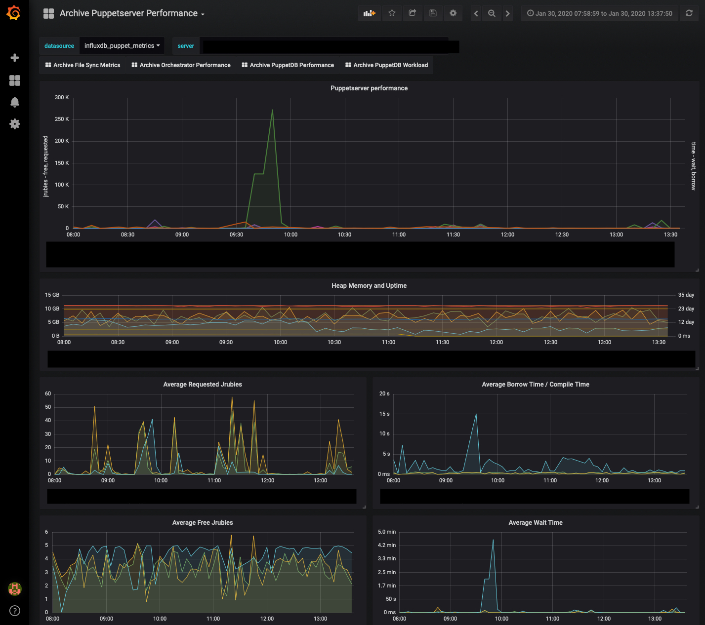

# puppet-metrics-viewer

This repository contains a command line tool for generating visualizations of your Puppet metrics data in Docker.

It assumes you have collected the metrics using the [puppetlabs/puppet_metrics_collector](https://forge.puppet.com/puppetlabs/puppet_metrics_collector) module.

It downloads a script from that module, and Grafana dashboards from the [puppetlabs/puppet_metrics_dashboard](https://github.com/puppetlabs/puppet_metrics_dashboard) module.

## Viewing metrics in Grafana



To use this tool, you will need [docker](https://www.docker.com/products/overview) (and docker-compose) installed.
_Tip:_ If you're using a Mac, use the official Mac packages for Docker instead of installing from Brew.
(If you figure out how to use this with Docker installed from Brew, let us know.)

With Docker installed, you can run the `view-in-grafana.sh` script, passing it the directory containing the data files to load.

For example:

```
./view-in-grafana.sh ~/Downloads/puppet_metrics/puppetserver
```

You can then view the metrics by visiting `http://localhost:3000` in a web browser.

 - username: `admin`
 - password: `admin`.

## Advanced options for viewing metrics with Grafana

The `view-in-grafana.sh` script has several options that can change the behavior of the environment.

### Limit the data that will be imported

By default, the script uses a data retention of 30 days.
You can optionally specify a different data retention period.

For example:

```
./view-in-grafana.sh ~/Downloads/puppet_metrics/puppetserver 10
```

_Note:_ `.json` files outside the retention period will be deleted, as the assumption is that they exist in the tar archives.

### Use Graphite as the backend database

By default, InfluxDB is used to store data.
You can optionally specify Graphite.

For example:

```
./view-in-grafana.sh -d graphite  ~/Downloads/puppet_metrics/puppetserver
```

### Build the local containers instead of from Docker Hub

To test Grafana updates, you can specify the `-b` option to build the local `grafana-puppetserver` container.

For example:

```
./view-in-grafana.sh -b ~/Downloads/puppet_metrics/puppetserver
```

## Load to a pre-existing InfluxDB or Graphite database backend

The `json2timeseriesdb` script from [puppetlabs/puppet_metrics_collector](https://forge.puppet.com/puppetlabs/puppet_metrics_collector) module can be used to transform data in the JSON files into a format that can be imported into any InfluxDB or Graphite database backend.

Usage:

```
./json2timeseriesdb [--pattern PATTERN] [filename_1 ... filename_n]
```

Output is in Graphite's plain text input format.
The output can be sent to a host running Graphite by passing its hostname to the `--netcat` flag:

```
./json2timeseriesdb ~/Downloads/logdump/puppetserver/*.json --netcat localhost
```

Data will be sent to port 2003.
A custom port can be used by sending output to `nc`:

```
./json2timeseriesdb ~/Downloads/logdump/puppetserver/*.json | nc localhost 4242
```

Output in InfluxDB's format can be specified using the `--convert-to` flag:

```
./json2timeseriesdb ~/Downloads/logdump/puppetserver/*.json --convert-to influxdb
```

When `--netcat` is used with InfluxDB, the `--influx-db` flag must be used to specify an InfluxDB database:

```
./json2timeseriesdb ~/Downloads/logdump/puppetserver/*.json --convert-to influxdb --netcat localhost --influx-db pe-metrics
```

(Data will be sent to port 8086.)

The above examples can be used for small numbers of files.
When more files exist than can be referenced as arguments, use `--pattern`:

```
./json2timeseriesdb --pattern '~/Downloads/logdump/puppetserver/*.json' --netcat localhost
```

The `--pattern` flag accepts a Ruby glob argument, which Ruby will then expand into a list of files to process.
